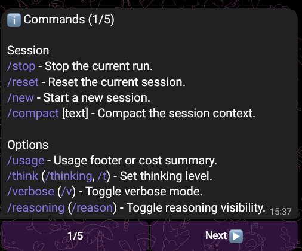
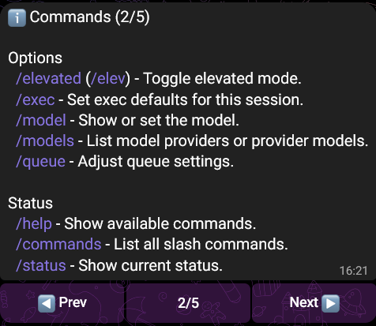
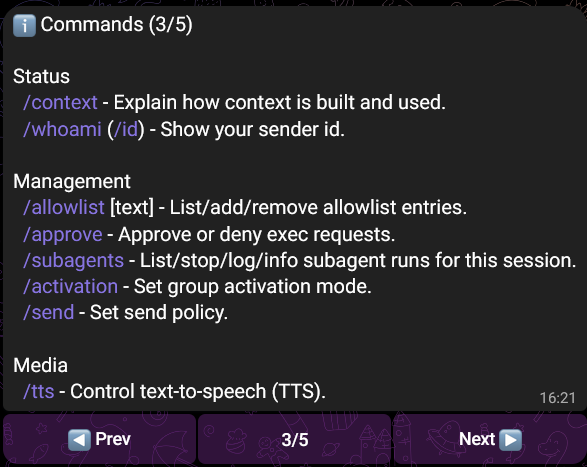
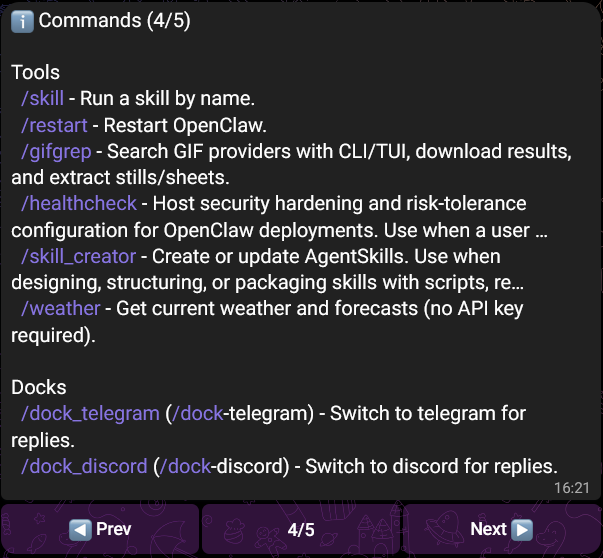

- /stop: dừng session.

- /reset: reset session

- /new: bắt đầu một session mới

- /compact [instructions]: tóm tắt gọn session context, giúp cho session nhanh gọn hơn.

- /usage off|tokens|full|cost: hiển thị token usage (kèm giá thành và thời gian).

- /think <off|minimal|low|medium|high|xhigh>: chuyển model sang trạng thái suy nghĩ, thời gian phản hồi lâu hơn nhưng trả lời chất lượng hơn.

- /verbose on|full|off: bật tắt output cụ thể hơn.

- /reasoning on|off|stream: bật tắt khả năng nhìn thấy từng bước suy nghĩ của agent. Khi on, agent sẽ giải thích suy nghĩ của nó. stream: dành cho telegram only.

- /elevated on|off|ask|full: cho phép các công cụ của agent thực hiện các command cần cấp cao hơn. Command này không cấp quyền mới cho agent mà chỉ bảo agent sử dụng các command cấp cao nếu cần thiết.

- /exec host=<sandbox|gateway|node> security=<deny|allowlist|full> ask=<off|on-miss|always> node=<id>: đặt giá trị default cho các công cụ khác trong session (ví dụ như cwd, timeout, pty, elevated, ask...)

- /model \<name>: hiển thị hoặc chọn model được sử dụng.

- /models: hiển thị danh sách model có thể chuyển sang.

- /queue \<mode>: hiện thị hàng chờ tool/job trong session.

- /context [list|detail|json]: hiện thị snapshot context của đoạn hội thoại hiện tại mà model đang dùng (có thể hiểu là trí nhớ của session hiện tại)

- /whoami: hiển thị id của người chạy command (channel đang chat, id)

- /allowlist: hiển thị, thêm hoặc xóa allowlist (những công cụ, hành động mà bot được can thiệp)

- /approve <id> allow-once|allow-always|deny: cho phép hoặc từ chối exec request.

- /subagents list|stop|log|info|send: show danh sách, dừng, log, lấy info của subagent trong session này.

- /activation mention|always: bot sẽ phản hổi khi được tag hay khi có người chat (chỉ dành cho nhóm)

- /send on|off|inherit: 

- /tts off|always|inbound|tagged|status|provider|limit|summary|audio: điều khiển text-to-speech

- /skill \<name> [input]: chạy skill theo tên

- /restart: restart OpenClaw

- /dock-telegram: chuyển phản hổi sang telegram

- /dock-discord: chuyển sang discord

- /dock-slack: chuyển sang slack
