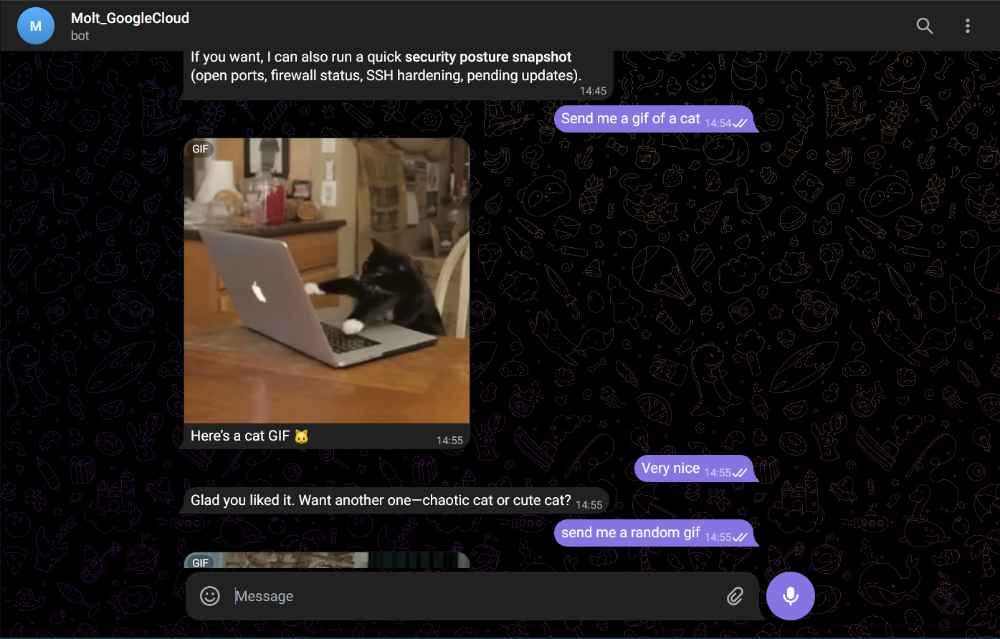
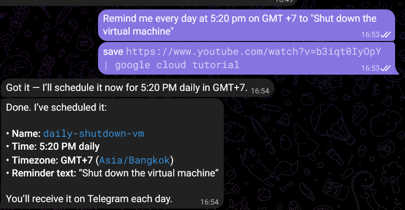
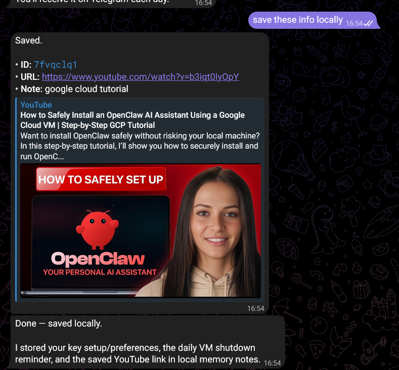

<h1 align="center">Setup OpenClaw trong VM trong Google Cloud</h1>

Lí do lựa chọn Google Cloud:

- Có free tier 90 ngày, free $300 credit. Cần nhập thông tin thanh toán bằng thẻ Visa hoặc Mastercard để sử dụng free trial.

- Nền tảng được sử dụng phổ biến, nhiều tài liệu tham khảo và hỗ trợ.

Sau khi đăng ký free trial thành công, thực hiện tạo VM.

Thông số VM sử dụng:

- Khu vực: us-central1-c

- Kiến trúc: x86-64

- OS: Ubuntu 24.04 LTS Minimal.

- Loại máy sử dụng: e2-medium (2 vCPU, 4GB memory)

- Storage: 70 GB

Sau khi tạo xong VM instance, cần SSH vào nó để thực hiện tương tác. Có thể sử dụng SSH trong trình duyệt có sẵn của Google Cloud hoặc SSH từ cmd hoặc terminal của máy người dùng.

Note: để thực hiện SSH từ cmd, cần lấy ssh key bằng cách chạy command ssh-keygen. Windows sẽ tạo một một key ssh trong file C:\Users\\<your_username>\\.ssh\id_ed25519. Chạy type C:\Users\\<your_username>\\.ssh\id_ed25519.pub | clip để lấy key và copy vào clipboard. Sau đó tại web của Google Cloud, tìm kiếm Metadata của Computer Engine và nhập SSH key vào. Sau đó người dùng có thể SSH từ cmd bằng cách chạy ssh \<username>@\<public_ip>

Setup Openclaw: thực hiện tải NodeJS, npm, git và OpenClaw như những hướng dẫn trước.

Note: khi setup model, có thể setup bằng oauth hoặc API key. Riêng cho ChatGPT, tài khoản free không thể sử dụng API key nên cần phải sử dụng oauth. Khi wizard gửi link để thực hiện liên kết với model, copy link đó vào một trình duyệt khác, thực hiện đăng nhập và xác nhận liên kết để nhận link redirect. Copy link redirect đó vào wizard để hoàn thành setup agent.

Trong bài này thực hiện setup bằng ChatGPT model GPT 5.2 và sử dụng Telegram làm channel chính. Thực hiện setup channel giống hướng dẫn trước.

Thành quả:

Bot có thể thực hiện một số skill như set reminder và lưu link. Ví dụ:

