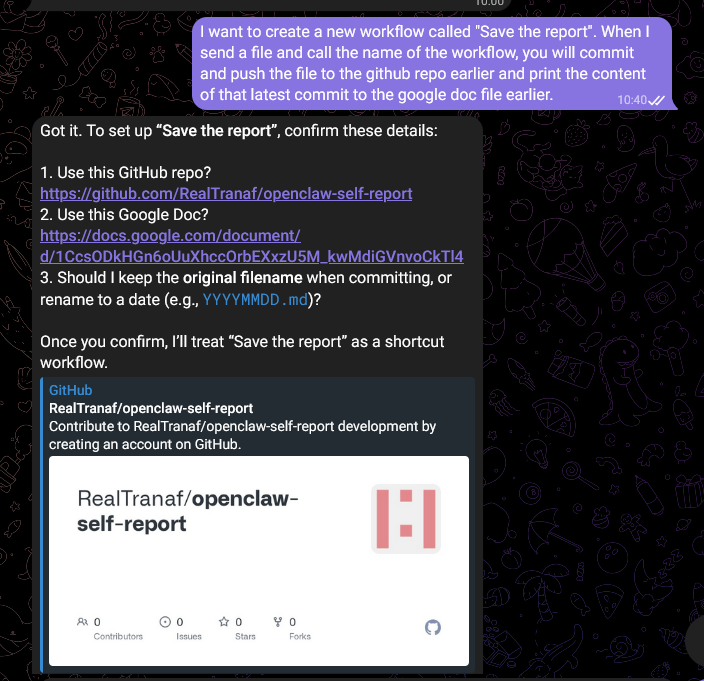

**Note khi thực hiện push Github bằng OpenClaw**

- Tiêu tốn rate kha khá, dùng vừa phải.

- OpenClaw không biết tên file người dùng đưa cho, cần phải nói rõ muốn tên của file là gì.

**(Nối tiếp hôm qua) Tạo script để cập nhật địa chỉ IP cho web server và chạy docker container**

Do địa chỉ IP public có thể thay đổi => nên có cách cập nhật IP khi cần chạy web server:
```
#!/usr/bin/env bash
set -euo pipefail

SITE_DIR="/home/linhduy249/site"
CADDYFILE="$SITE_DIR/Caddyfile"

PUBLIC_IP="$(curl -s https://api.ipify.org)"

cat > "$CADDYFILE" <<EOF
http://$PUBLIC_IP {
    root * /srv
    file_server
}
EOF

cd "$SITE_DIR"
docker compose up -d

echo "Updated Caddyfile with IP: $PUBLIC_IP"
```
Script lấy địa chỉ IP public -> sửa Caddyfile -> chạy docker compose.

Có thể tự chạy script hoặc để OpenClaw chạy.

**Web hiển thị status của OpenClaw**

```
#!/usr/bin/env bash
set -euo pipefail

SITE_DIR="/home/linhduy249/site"
STATUS_OUT="$SITE_DIR/public/status.json"

while true; do
  {
    echo "Updated at (GMT+7): $(TZ='Asia/Bangkok' date '+%Y-%m-%d %H:%M:%S')"
    echo ""
    openclaw status
  } > "$STATUS_OUT" 2>&1 || echo "OpenClaw status unavailable" > "$STATUS_OUT"
  sleep 30
done
```
Script status_updater.sh chạy lệnh openclaw status 30 giây 1 lần.


```
#!/usr/bin/env bash
set -euo pipefail

SITE_DIR="/home/linhduy249/site"
CADDYFILE="$SITE_DIR/Caddyfile"
PUBLIC_IP="$(curl -s https://api.ipify.org)"

cat > "$CADDYFILE" <<EOF
http://$PUBLIC_IP {
    root * /srv
    file_server
}
EOF

# Start status updater in background (every 30s)
PID_FILE="$SITE_DIR/.status_updater.pid"
if [ -f "$PID_FILE" ] && kill -0 "$(cat "$PID_FILE")" 2>/dev/null; then
  :
else
  bash "$SITE_DIR/status_updater.sh" &
  echo $! > "$PID_FILE"
fi

cd "$SITE_DIR"
docker compose up -d

echo "Updated Caddyfile with IP: $PUBLIC_IP"
```
Script chính sẽ chạy script update status trong background.

```
<!doctype html>
<html lang="en">
<head>
  <meta charset="UTF-8" />
  <meta name="viewport" content="width=device-width, initial-scale=1.0" />
  <title>OpenClaw Status</title>
  <style>
    body { font-family: system-ui, sans-serif; padding: 24px; }
    pre { background: #111; color: #0f0; padding: 16px; border-radius: 8px; white-space: pre-wrap; word-break: break-word }
  </style>
</head>
<body>
  <h1>OpenClaw Status</h1>
  <p>Auto-refreshes every 60 seconds.</p>
  <pre id="status">Loading...</pre>

  <script>
    async function loadStatus() {
      try {
        const res = await fetch('/status.json', { cache: 'no-store' });
        const text = await res.text();
        document.getElementById('status').textContent = text;
      } catch (e) {
        document.getElementById('status').textContent = 'Failed to load status.json';
      }
    }

    loadStatus();
    setInterval(loadStatus, 60000);
  </script>
</body>
</html>
```

Script JS sẽ lấy nội dung file status.json và cập nhật DOM của html 60 giây 1 lần (chọn chu kì lớn hơn chu kì cập nhật status)

**OpenClaw tương tác với văn bản Google Docs**

Có 2 cách để cho phép OpenClaw tương tác với Google Docs là kết nối qua OAuth hoặc sử dụng service account.

- OAuth: người dùng đăng nhập và trao quyền quản lý Google Docs thông qua OAuth. OpenClaw sẽ nhận access và refresh token gắn với tài khoản và có thể đọc hoặc viết mọi file doc mà tài khoản có thể truy cập.

=> Tiện lợi nhưng bảo mật kém hơn, khó kiểm soát kĩ càng.

- Service account: Tạo một service account trong Google Cloud và đưa JSON key của nó cho OpenClaw. Service account sẽ có địa chỉ email riêng để người dùng share và cấp quyền cho nó (Viewer, Commenter và Editor) và OpenClaw sẽ tương tác với doc qua service account này.

=> Phải share riêng cho từng doc mà người dùng muốn OpenClaw tương tác nhưng bảo mật tốt hơn, có thể phân quyền kĩ càng cho OpenClaw

Nên chọn sử dụng service account để tối đa bảo mật.

Cách setup:
B1: Tại Google Cloud, tìm và bật Google Docs API và Google Drive API.

B2: Vào APIs & Services -> Credentials -> Create Credentials -> Service Account. Đặt tên cho service account và tạo.

B3: Lấy JSON key: Credentials -> Service Accounts -> Account vừa tạo -> Keys -> Add Key -> Create new key. Chọn JSON và tải JSON key về.

B4: Vào Google Doc cần chia sẻ, ấn share và thêm địa chỉ email của service account vừa tạo. Chọn quyền access và lưu.

B5: Đặt JSON key vào trong hệ thống chạy OpenClaw

Bây giờ người dùng chỉ cần bảo OpenClaw địa chỉ của file JSON key và URL của Google Doc.

**Setup workflow gủi report cho OpenClaw**

Sau khi đã config Github repo và Google Doc cho hệ thống, có thể setup workflow để khi chat với bot, chỉ cần đính kèm và gửi note nếu cần và bot sẽ tự commit lên repo và thêm nội dung vào doc.



Xác nhận repo và doc, thêm một số yêu cầu như commit message và cách format trong doc và setup workflow sẽ hoàn thành.

Repo ví dụ: https://github.com/RealTranaf/openclaw-self-report

Doc: https://docs.google.com/document/d/1CcsODkHGn6oUuXhccOrbEXxzU5M_kwMdiGVnvoCkTl4/edit?usp=sharing