OpenClaw (hay còn gọi là OpenClawd, Moltbot, Clawd) là một AI agent, trợ lý cá nhân có thể chạy local hoặc server.

Trao đổi và trả lời câu hỏi qua các nền tảng chat như WhatsApp, Telegram, Slack, Discord, Google Chat, Microsoft Teams, Zalo...

Kế hoạch: setup Moltbot trong môi trường máy ảo Virtualbox chạy hệ điều hành Ubuntu.

Mô tả môi trường / Yêu cầu về công cụ:

Ubuntu: 24.04

NodeJS: 24.13.0

npm: 11.6.2

git

**Setup cơ bản sử dụng Onboarding Wizard**

Document của OpenClaw: https://docs.openclaw.ai/

Tải về CLI: curl -fsSL https://openclaw.ai/install.sh | bash

Command này sẽ tải về onboarding wizard của OpenClaw, giúp người dùng dễ dàng setup các thành phần quan trọng qua terminal như:

- model/auth (OpenClaw khuyên sử dụng OAuth). Em sử dụng OAuth của ChatGPT/OpenAI sử dụng model gpt 5.2 phiên bản free qua email molttesting123@gmail.com

- setting gateway: port websocket để tương tác với OpenClaw. Sử dụng port default là 18789.

- channel: kênh chat để tương tác với OpenClaw như Discord, WhatsApp, Telegram... Hiện tại chưa setup channel, mới chỉ chat với bot qua dashboard của OpenClaw.

- pairing default (nhắn tin bảo mật)

- workspace bootstrap + skills: những addon cho OpenClaw để mở rộng thêm tính năng

- optional background services

Sau khi đã cài đặt qua onboarding wizard, gateway sẽ tự động chạy và người dùng có thể truy cập dashboard local qua http://127.0.0.1:18789/ để có thể thực hiện chat với OpenClaw. Đây là cách nhanh nhất để thực hiện chat lần đầu.

Dashboard

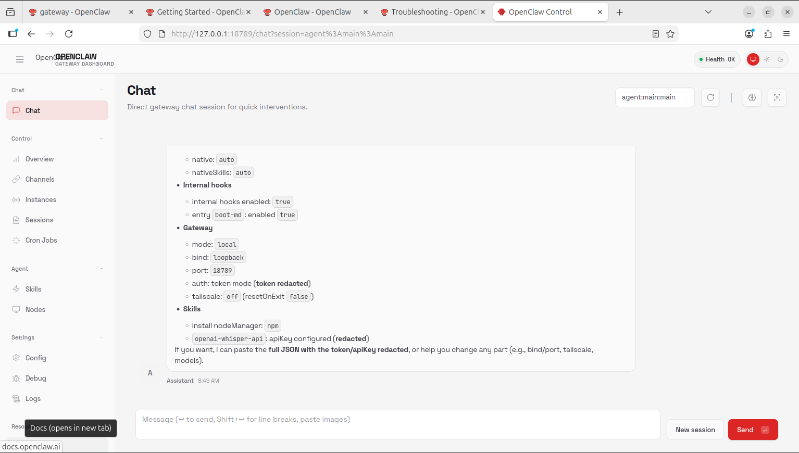

**Lưu ý khác về Onboarding Wizard**

Để chạy onboarding wizard: openclaw onboard --install-daemon

Sau khi cài đặt, nếu muốn config lại: openclaw configure

Config của OpenClaw nằm tại ~/.openclaw/openclaw.json, khi chạy wizard thì nội dung file config sẽ ko bị xóa trừ khi người dùng chọn reset config (--reset)

OAuth credentials nằm ở file ~/.openclaw/credentials/oauth.json

Auth profile (API key + OAuth) nằm ở file ~/.openclaw/agents/<agentId>/agent/auth-profiles.json

**Một số command hữu ích khi chạy**

Chạy gateway: openclaw gateway start

Dừng gateway: openclaw gateway stop

Restart gateway: openclaw gateway restart

Kiểm tra trạng thái của gateway: openclaw gateway status

Kiểm tra trạng thái của OpenClaw: openclaw status

Kiểm tra health của OpenClaw: openclaw health

**Setup channel cho OpenClaw**

Setup channel cho OpenClaw sử dụng Discord.

Document: https://docs.openclaw.ai/channels/discord

**1. Tạo bot Discord:**

Vào setting tài khoản Discord -> bật Developer Mode và nhấn vào Discord API để tới Discord Developer Portal. 

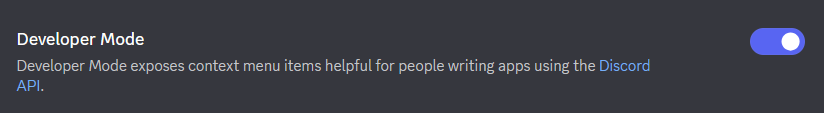

Vào tab Application -> New Application, đặt tên cho App mới và confirm. Ví dụ của app mới đã tạo:

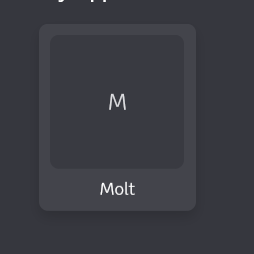

Trong trang của app, vào tab Bot -> bật Message Content Intent để bot có thể đọc và trả lời tin nhắn, bật Server Members Intent để bot có thể tìm kiếm người dùng trong server -> Lưu.

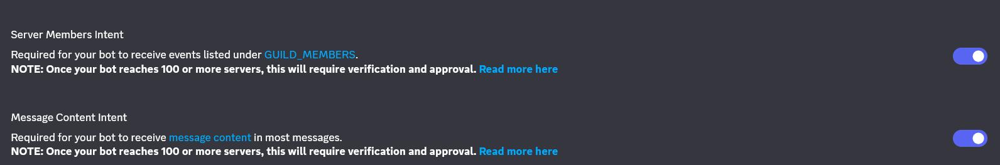

Vào tab OAuth2, đặt quyền hạn của bot. Trong ví dụ này, chọn bot và applications.commands để xác định rằng app đã tạo là bot và có thể cung cấp command cho người dùng. Tại phần Bot Permissions, chọn View Channels, Send Messages và Read Message History để bot có thể xem danh sách channel trong server, gửi tin nhắn và đọc lịch sử tin nhắn.

Sau khi hoàn thành, copy đoạn URL ở cuối và truy cập trong 1 tab mới để cài đặt bot vào trong server mà người dùng sở hữu (nếu chưa có server thì người dùng cần tạo một server Discord riêng)

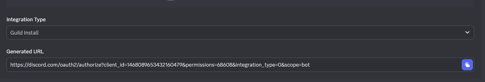

Khi bot đã ở trong server thì chuyển sang config tại Openclaw.

**2. Config tại Openclaw:**

Nếu chưa cài đặt Openclaw: openclaw onboard --install-daemon để chạy onboarding wizard.

Nếu đã cài đặt: openclaw configure để config.

Khi config mục Channels, chọn Discord (Bot API)

Khi được yêu cầu nhập Discord bot token, nhập token của bot vừa tạo vào.

- Để lấy token của bot, tại trang của app trong Discord Development Portal, vào tab Bot và nhấn Reset Token để lấy token.

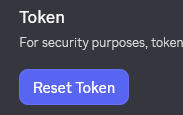

Discord Channel Access: có thể chọn Open (cơ bản, mở cho tất cả channel) hoặc allowList (có thể config channel cụ thể hơn)

Hoàn thành quá trình config và nếu chưa bật gateway của OpenClaw thì thực hiện openclaw gateway start.

Khi này thì bot sẽ online và có thể bắt đầu thực hiện chat với bot.

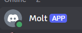

**3. Thử chat với bot trong Discord**

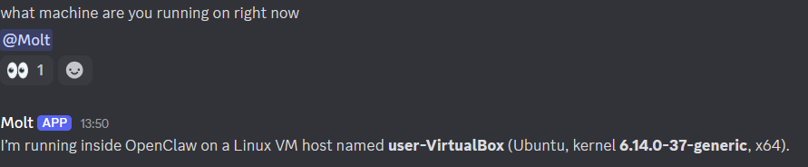

=> OpenClaw biết nó đang hoạt động tại thiết bị nào và có thể trả lời thông tin đó cho người dùng.

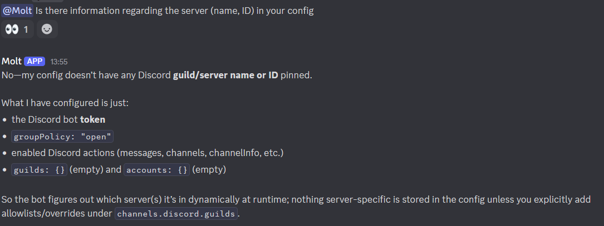

=> Hiện tại groupPolicy của OpenClaw đang để là open, bot sẽ tự detect server hiện tại khi chạy và không có server (guilds), channel hay tài khoản nào được chỉ định riêng.

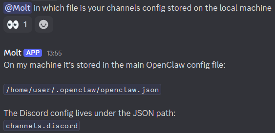

=> OpenClaw có quyền xem hệ thống file của máy đang host nó. Chính vì vậy nên OpenClaw nên được host trong một máy chủ remote, một máy tính tách biệt với máy cá nhân hoặc một VM để đảm bảo vấn đề bảo mật.

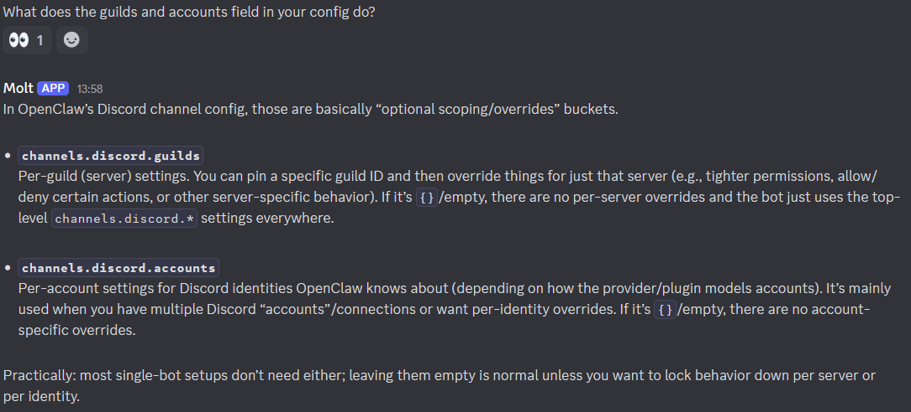

=> OpenClaw giải thích thêm về config Discord.

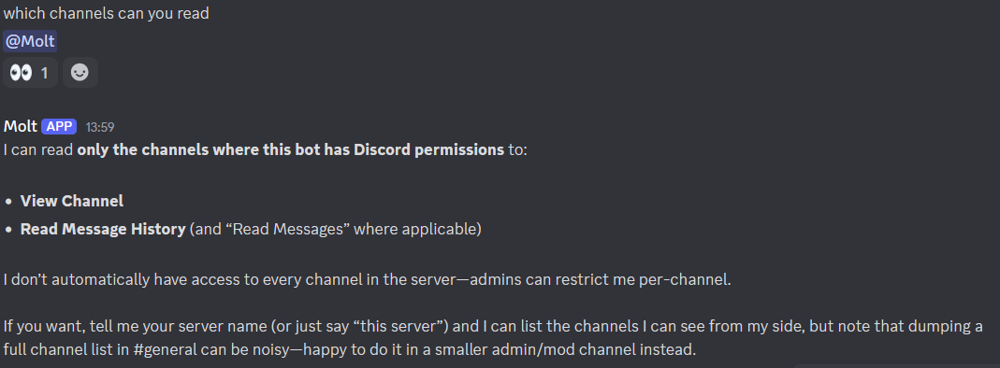

=> OpenClaw trình bày những quyền đã được phân: xem danh sách channel và đọc lịch sử tin nhắn.

**5. Cập nhật groupPolicy từ open sang allowList**

Trong Discord, groupPolicy có 3 option: open, disabled và allowList. Nếu muốn có khả năng kiểm soát phạm vi hoạt động của bot một cách kĩ càng hơn từ phía OpenClaw thì cần chuyển từ open sang allowList.

Cần edit config file của OpenClaw trong /home/user/.openclaw/openclaw.json, path channels.discord.groupPolicy

```
{
  "channels": {
    "discord": {
      "groupPolicy": "allowlist"
    }
  }
}
```

Set groupPolicy sang allowlist

Sau đó, thêm allowlist entry cho 1 server (gọi là guild) ở mục channels.discord.guilds.<GUILD_ID>. Tại đây có thể allow một số user hay channel nhất định. Ví dụ:

```
{
  "channels": {
    "discord": {
      "groupPolicy": "allowlist",
      "guilds": {
        "GUILD_ID": {
          "users": ["USER_ID"],
          "channels": {
            "CHANNEL_ID": { "allow": true }
          }
        }
      }
    }
  }
}
```

Các ID này là 1 dãy số. Có thể set requireMention: true ở tầng guild nếu chỉ muốn bot phản hồi khi được ping.

Sau khi đã thay đổi, restart gateway để áp dụng những thay đổi trên.
